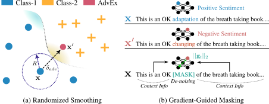

# Randomized Smoothing with Masked Inference for Adversarially Robust NLP Systems

<p align="center">

</p>

- Accepted for Association for Computational Linguistics (**_ACL'23_**)  

## Setup
1. Pip installation
2. Docker

## Train Models:

- Fine-tune PLMs
```
CUDA_VISIBLE_DEVICES=0 python3 main_base.py --model_dir_path ./cls_task/checkpoint/ --dataset ag --batch_size 24 --epochs 10 --save_model base_roberta_ag --model roberta --save --max_seq_length 256 --lr 0.00001 --save
```

- RSMI models
```
CUDA_VISIBLE_DEVICES=0 python3 main_org_seq.py --model_dir_path ./cls_task/checkpoint/ --dataset ag --batch_size 16 --epochs 10 --save_model rsmi_roberta_ag --model roberta --nth_layers 3 --noise_eps 0.2 --max_seq_length 256 --multi_mask 2 --custom_forward --save
```

## Attack Models:

- Fine-tuned PLMs
```
CUDA_VISIBLE_DEVICES=0 python3 textattack_main.py --model_dir_path ./cls_task/checkpoint/ --load_model base_roberta_ag_0 --dataset imdb --nth_data 0 --seed 0 --dataset_type test --save_data --model roberta --attack_method textfooler --n_success 1000 --batch_size 1 --max_seq_length 256 --model_type base --max_rate 1.0
```

- RSMI models
```
CUDA_VISIBLE_DEVICES=0 python3 textattack_main.py --model_dir_path ./cls_task/checkpoint/ --load_model test_0 --dataset imdb --nth_data 0 --seed 0 --dataset_type test --save_data --model roberta --attack_method textfooler --n_success 1000 --batch_size 1 --nth_layer 3 --noise_eps 0.2 --multi_mask 2 --max_rate 1.0 --num_ensemble 5 --custom_forward --hf_model --max_seq_length 256 --model_type rsmi --adv_batch_size 20 --alpha_p 0.98 --two_step
```

